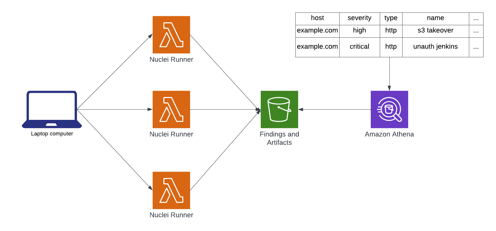

When new security research is out, the spin up time to scour assets for vulnerabilities can be a long and tedious task. Spending time learning about the latest findings, how to exploit them, and what conditions are required in order to exploit them. How can you stay on top of it all when it is a constant battle repeating itself? 

That is the exact problem projects like [Nuclei](https://github.com/projectdiscovery/nuclei) are made for; To help researchers identify known issues through a powerful templating language to ensure you not miss out. It can also help you identify issues such as known subdomain takeovers, exposed panels, network services, misconfigurations, exposed files, and the list goes on. It does an outstanding job when you have a limited number of assets and are performing scans individually. Though the moment you have hundreds or thousands of assets, scaling vertically is no longer an option. 



Performing scanning at scale is exactly what [Nuclear Pond](https://github.com/DevSecOpsDocs/nuclearpond), in addition to [Nuclear Pond Backend Terraform Module](https://github.com/DevSecOpsDocs/terraform-nuclear-pond), is meant to achieve. You can launch thousands of scans without having to worry about cost, waiting for extended periods of time, and customize how many scans you want to perform in parallel. It is designed for unremarkable speed, flexibility, and perform scans on thousands of assets for far less than a cup of coffee. Once the scans are complete you can choose to upload them to S3 for querying with Athena. Allowing you to create dashboards and alerts in tools such as Grafana, Superset, Elasticsearch, Redash, and more. It can help you visualize your attack surface and vulnerabilities such as:

- Identify assets vulnerable to subdomain takeovers
- Provide a comprehensive identification on exposed assets such as Jenkins, Elasticsearch, Grafana, and many more
- Locate exposed files, logs, configurations, backups, etc.
- Misconfigurations that can lead to information disclosure
- Network services such as ssh, ftp, telnet, mysql, etc.
- Known vulnerabilities in exposed assets
- Published CVEs that can be easily exploited

[](https://xkcd.com/1162/)

### What is Nuclei

Nuclei is a tool that allows you to create configuration files to validate a wide variety of security issues. Contributing to [Nuclei](https://github.com/projectdiscovery/nuclei/pull/3088) and [Nuclei Templates](https://github.com/projectdiscovery/nuclei-templates/pull/6440) is a breeze. When running nuclei, you can specify what security issues you are trying to identify and launch a scan against your hosts. This can often be slow on your local machine even with rate limits and concurrency settings configured. While they have done an outstanding job creating a fast scanner, doing so at scale can be difficult. Lets take a deep dive into each component of Nuclei. 

### Nuclei Templates

[ProjectDiscovery](https://projectdiscovery.io) maintains the repository [nuclei-templates](https://github.com/projectdiscovery/nuclei-templates) which contains various templates for the nuclei scanner provided by them and the community. Contributions are welcome and straight forward to add to based on previous examples and you can reference my [pull request](https://github.com/projectdiscovery/nuclei-templates/pull/6440) to get a sense of just how easy it is. 

### Nuclei Usage

This is to help you understand how nuclei can be used to your advantage and help you understand what nuclei can catch buried within your infrastructure. 

- Filter by tags `-tags takeover`
- Filter by templates directory `-t dns`
- Filter by specific template `-t dns/detect-dangling-cname.yaml`
- Exclude by tags `-etags cve`

#### Detecting Network Services

Here is an example in which we want to enumerate some protocols running on [scanme.nmap.org](http://scanme.nmap.org) with the [network detection templates](https://github.com/projectdiscovery/nuclei-templates/tree/main/network/detection). This will help us identify network services running on the specified host. This allows us to currently check over 40 different network based services such as ssh, smtp, mysql, mongodb, telnet, etc. 

```log
$ nuclei -u scanme.nmap.org -t network/detection

                     __     _
   ____  __  _______/ /__  (_)
  / __ \/ / / / ___/ / _ \/ /
 / / / / /_/ / /__/ /  __/ /
/_/ /_/\__,_/\___/_/\___/_/   v2.8.3

		projectdiscovery.io

[INF] Using Nuclei Engine 2.8.3 (latest)
[INF] Using Nuclei Templates 9.3.2 (latest)
[INF] Templates added in last update: 57
[INF] Templates loaded for scan: 42
[INF] Targets loaded for scan: 1
[openssh-detect] [network] [info] scanme.nmap.org:22 [SSH-2.0-OpenSSH_6.6.1p1 Ubuntu-2ubuntu2.13]
```

#### Detecting Takeovers

Takeovers can be a common occurrence when you manage thousands of zones within your infrastructure and mistakes certainly occur in which deprecating assets may not complete in the correct order or completely. This can lead to dangling assets that can be taken over by an attacker. The repository [Can I take over XYZ](https://github.com/EdOverflow/can-i-take-over-xyz) is an excellent resource if you want to learn what the current landscape looks like at this time. 

Nuclei currently has over 70 different templates to detect if you are currently vulnerable to a takeover and here is an example as to how check to see if a domain is vulnerable. 

```log
$ nuclei -u https://jsdkjfskjsfdkdjfds.s3.amazonaws.com/ -tags takeover

                     __     _
   ____  __  _______/ /__  (_)
  / __ \/ / / / ___/ / _ \/ /
 / / / / /_/ / /__/ /  __/ /
/_/ /_/\__,_/\___/_/\___/_/   v2.8.3

		projectdiscovery.io

[INF] Using Nuclei Engine 2.8.3 (latest)
[INF] Using Nuclei Templates 9.3.3 (latest)
[INF] Templates added in last update: 238
[INF] Templates loaded for scan: 74
[INF] Targets loaded for scan: 1
[INF] Templates clustered: 69 (Reduced 68 HTTP Requests)
[aws-bucket-takeover] [http] [high] https://jsdkjfskjsfdkdjfds.s3.amazonaws.com/
```

## Nuclear PondUsage

Think of Nuclear Pond as just a way for you to run Nuclei in the cloud. You can use it just as you would on your local machine but run them in parallel and with however many hosts you want to specify. All you need to think of is the nuclei command line flags you wish to pass to it. 

### Setup & Installation

To install Nuclear Pond, you need to configure the backend [terraform module](https://github.com/DevSecOpsDocs/terraform-nuclear-pond). You can do this by running `terraform apply`, leveraging terragrunt, and on release we intend to make this easier to deploy. 

```bash
$ go install github.com/DevSecOpsDocs/Nuclear-Pond@latest
```

#### Command line flags

In order to specify the command line flags it's important to encode them as base64. When doing so it will send that off to the backend and run directly on nuclei. Any flags available in the current version should be available outside of `-o` and `-json`. 

```
$(echo -ne "-t dns" | base64)
```

### Data Lake Output

This output is recommended when leveraging Nuclear Pond as once the script invokes, all of the work is handed off to the cloud for you to analyze another time. This output is known as `s3` and you can output it by specifying `-o s3`. You can also specify `-l targets.txt` and `-b 10` to invoke the lambda functions in batches of 10 targets. 

```
$ nuclearpond run -t devsecopsdocs.com -a $(echo -ne "-t dns -silent" | base64) -o s3
  _   _                  _                           ____                        _
 | \ | |  _   _    ___  | |   ___    __ _   _ __    |  _ \    ___    _ __     __| |
 |  \| | | | | |  / __| | |  / _ \  / _` | | '__|   | |_) |  / _ \  | '_ \   / _` |
 | |\  | | |_| | | (__  | | |  __/ | (_| | | |      |  __/  | (_) | | | | | | (_| |
 |_| \_|  \__,_|  \___| |_|  \___|  \__,_| |_|      |_|      \___/  |_| |_|  \__,_|

                                                                  devsecopsdocs.com

2023/01/01 16:42:25 Running nuclei against the target devsecopsdocs.com
2023/01/01 16:42:25 Running with 1 threads
2023/01/01 16:42:26 Saved results in s3://test-nuclei-runner-artifacts/findings/2023/01/02/00/nuclei-findings-c69e8359-17b3-4783-b8c4-d6754b3235b8.json
2023/01/01 16:42:26 Completed all parallel operations, best of luck!
```

### Command Line Output

Think of this mechanism as a way to run the CLI directly on the cloud. All you have to do is specify the `-o` flag with `cmd` and you are launching Nuclei just as you would locally. 

```log
$ nuclearpond run -t devsecopsdocs.com -a $(echo -ne "-t dns -silent" | base64) -o cmd
  _   _                  _                           ____                        _
 | \ | |  _   _    ___  | |   ___    __ _   _ __    |  _ \    ___    _ __     __| |
 |  \| | | | | |  / __| | |  / _ \  / _` | | '__|   | |_) |  / _ \  | '_ \   / _` |
 | |\  | | |_| | | (__  | | |  __/ | (_| | | |      |  __/  | (_) | | | | | | (_| |
 |_| \_|  \__,_|  \___| |_|  \___|  \__,_| |_|      |_|      \___/  |_| |_|  \__,_|

                                                                  devsecopsdocs.com

2023/01/01 16:41:35 Running nuclei against the target devsecopsdocs.com
2023/01/01 16:41:35 Running with 1 threads
[nameserver-fingerprint] [dns] [info] devsecopsdocs.com [ns-487.awsdns-60.com.,ns-579.awsdns-08.net.,ns-1309.awsdns-35.org.,ns-1822.awsdns-35.co.uk.]
[mx-fingerprint] [dns] [info] devsecopsdocs.com [20 mailsec.protonmail.ch.,10 mail.protonmail.ch.]
[txt-fingerprint] [dns] [info] devsecopsdocs.com ["protonmail-verification=14a44944a2577395944d07e38d16139898edee75","v=spf1 include:_spf.protonmail.ch mx ~all"]
[mx-service-detector:ProtonMail] [dns] [info] devsecopsdocs.com

2023/01/01 16:41:35 Completed all parallel operations, best of luck!
```

### Retrieving Findings

To explore your findings in Athena all you need to do is perform the following query! The database and the table should already be available to you. You may also have to configure query results if you have not done so already. Once you are comfortable with querying Athena, it would be best to move over to help you visualize your results such as grafana. 


```sql
select
  *
from
  nuclei_db.findings_db
limit 10;
```

### Advance Query

In order to get down into queries a little deeper, I thought I would give you a quick example. In the select statement we drill down into `info` column, `"matched-at"` column must be in double quotes due to `-` character, and you are searching only for high and critical findings generated by Nuclei.

```sql
SELECT
  info.name,
  host,
  type,
  info.severity,
  "matched-at",
  info.description,
  template,
  dt
FROM 
  "nuclei_db"."findings_db"
where 
  host like '%devsecopsdocs.com'
  and info.severity in ('high','critical')
```

## Infrastructure

The backend infrastructure, all within [terraform module](https://github.com/DevSecOpsDocs/terraform-nuclear-pond). I would strongly recommend reading the readme associated to it as it will have some important notes. 

- Lambda function
- S3 bucket
  - Stores nuclei binary
  - Stores configuration files
  - Stores findings
- Glue Database and Table
  - Allows you to query the findings in S3
- IAM Role for Lambda Function

## Conclusion

What are you waiting for? Get started today. Contributions are welcome and looking forward to seeing issues created!

- [Nuclear Pond](https://github.com/DevSecOpsDocs/nuclearpond)
- [Nuclear Pond Backend Terraform Module](https://github.com/DevSecOpsDocs/terraform-nuclear-pond)